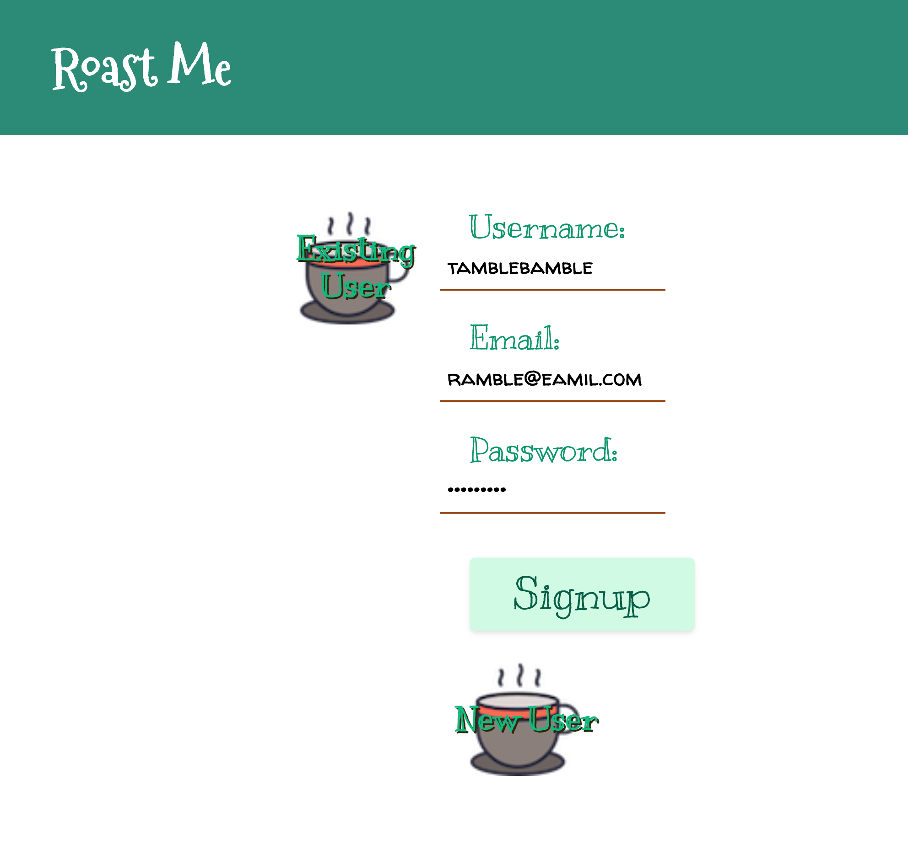
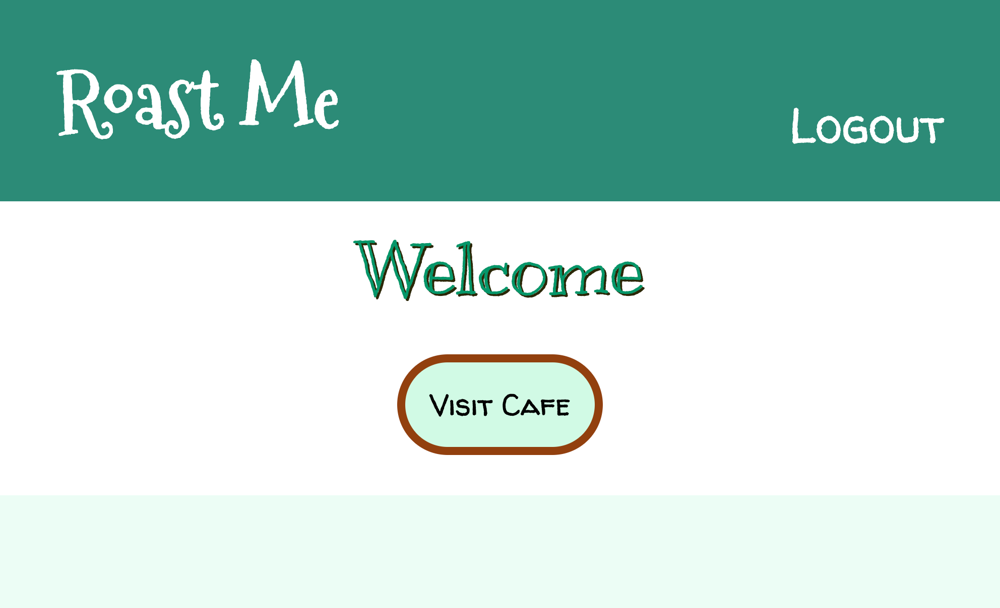
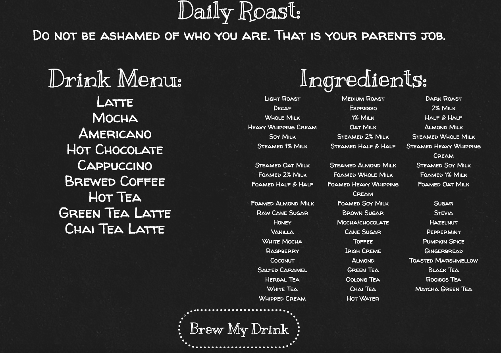
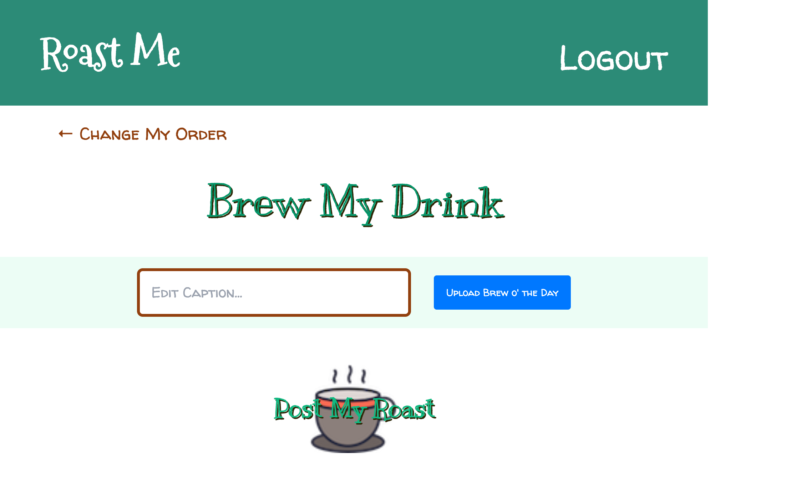
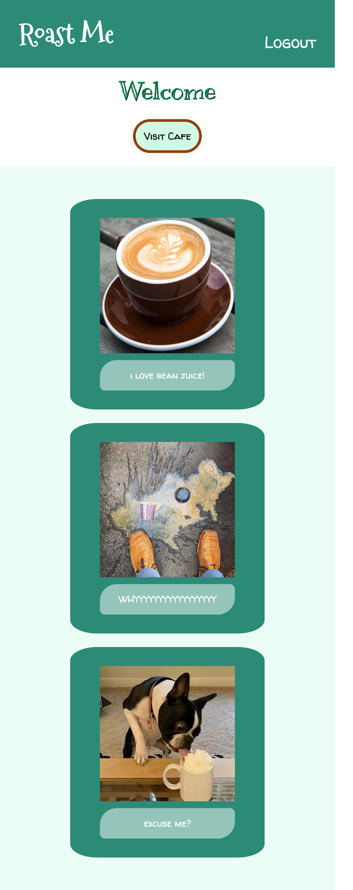

# Roast Me!
 
Ever wish people knew how you take your coffee everyday? Want friends and family to understand the exact drink specifications you require to get through life? Wish someone would take you down a peg? Welcome to ROAST ME where your wildest coffee logging dreams become reality! Post about your daily bean juice and get roasted in the process! Choose from the menu of drinks, whether you want hot or cold, and any ingredient substitutions, get insulted, then upload a photo and voila! A beautifully customized coffee post to show the world you are a unique snowflake that seldom deviates from routine, your predictability isn’t just for baristas anymore!
 
  

## Description
 ##### [Back to Table of Contents](#Table-of-Contents)
 
* _This application allows the user to create a post documenting coffee drinks and displays a random insult._
* _When the user logs in they will be able to choose from a menu of coffee drinks, weather the drink is hot or cold, and upload a photo._
* _Add a caption to your post so everyone knows how you feel about your coffee!_

## Table of contents
  * [Description](#Description)
  <!-- * [Installation Instructions](#installation-Instructions) -->
  * [Usage Instructions](#Usage-Instructions)
  <!-- * [Questions](#Questions) -->

  * [Future Development](#Future-Development)

  * [Contributing](#Contributing)
  
  * [License](#License)

## Purpose
##### [Back to Table of Contents](#Table-of-Contents)
* _This page is meant for fun documentation of coffee intake, including special features to make you feel a little bit bad about yourself_

## Built With
 ##### [Back to Table of Contents](#Table-of-Contents)

* _HTML_
* _CSS_
* _Javascript_
* _Node_
* _Express_
* _MySQL_
* _Sequelize_
* _Handlebars_
* _Bcrypt_
* _Dotenv_
* _Cloudinary_

## Link to project launched on GitHub Pages:
##### [Back to Table of Contents](#Table-of-Contents)
 https://github.com/EACrook/Roast-Me 

## Screenshots 
<h3 align="center" width="100%">
  1. Create New User 

    

2. Welcome, visit the cafe!

    

3. Heres the menu, don't forget to be insulted

    

4. type a caption and a photo and brew that drink!

    

5. look what everyone posted!

    

## Future Development
##### [Back to Table of Contents](#Table-of-Contents)
* _A clickable menu that populates the post form_
* _time stamps on posts_
* _posts can be 'liked' by other users_

## Contribution
##### [Back to Table of Contents](#Table-of-Contents)
*Fahrija Wyroski, Emily Crook, Katie Redford, & Becca Wyland*

## License 

  ##### [Back to Table of Contents](#Table-of-Contents)
  * License Type: MIT
    
    [License: MIT](https://opensource.org/licenses/MIT)
    Permission is hereby granted, free of charge, to any person obtaining a copy of this software and associated documentation files (the "Software"), to deal in the Software without restriction, including without limitation the rights to use, copy, modify, merge, publish, distribute, sublicense, and/or sell copies of the Software, and to permit persons to whom the Software is furnished to do so, subject to the following conditions:The above copyright notice and this permission notice shall be included in all copies or substantial portions of the Software.THE SOFTWARE IS PROVIDED "AS IS", WITHOUT WARRANTY OF ANY KIND, EXPRESS OR IMPLIED, INCLUDING BUT NOT LIMITED TO THE WARRANTIES OF MERCHANTABILITY, FITNESS FOR A PARTICULAR PURPOSE AND NONINFRINGEMENT. IN NO EVENT SHALL THE AUTHORS OR COPYRIGHT HOLDERS BE LIABLE FOR ANY CLAIM, DAMAGES OR OTHER LIABILITY, WHETHER IN AN ACTION OF CONTRACT, TORT OR OTHERWISE, ARISING FROM, OUT OF OR IN CONNECTION WITH THE SOFTWARE OR THE USE OR OTHER DEALINGS IN THE SOFTWARE.
* License Type: GPL
